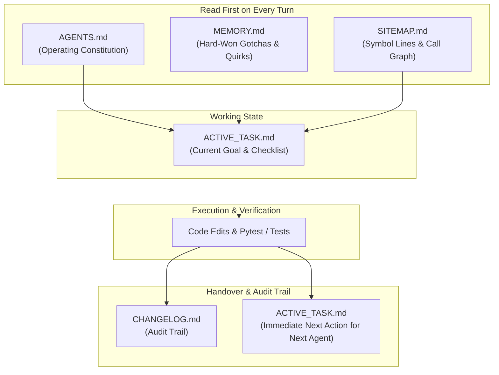
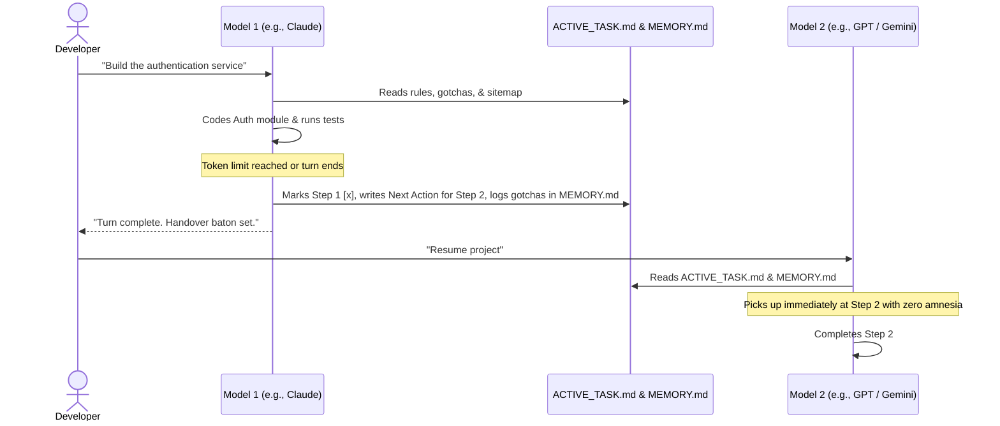

# ⚡ FirstSpark

> **The Universal Living Memory, Navigation & Coordination Engine for Multi-Agent AI Software Engineering.**  
> *Transform any codebase into a self-evolving, context-aware "alive" system that works seamlessly across any AI provider (Anthropic Claude, OpenAI GPT, Google Gemini, xAI Grok, Meta Muse, local LLMs).*

[](https://opensource.org/licenses/MIT)
[]()
[-brightgreen.svg)]()
[]()

---

## 🎯 The Problem: Why AI Agents Fail in Real Projects

Most developers use AI agents as **ephemeral calculators**: they ask a question, the agent writes code, and when the session ends or token limits hit, **everything is forgotten**.

In real software projects, this causes 4 catastrophic failure modes:

1. **The "Groundhog Day" Trap:** You spend 2 hours helping an agent debug an obscure framework or API quirk. Two days later, a new agent session hits the same bug and wastes another 2 hours because institutional knowledge was never saved.
2. **Context Amnesia on Model Switching:** When your primary model hits rate limits and you switch providers (e.g. Claude → GPT / Gemini), the incoming model has zero idea what was being worked on and asks: *"Hello! How can I help you today?"*.
3. **Token-Burning Blind Searches:** In a 500-file project, agents burn tens of thousands of tokens running random `grep` queries, guessing paths, and hallucinating imports.
4. **Architectural Drift & Silent Regressions:** Agents modify a core file and inadvertently break downstream modules because the repository had no explicit rule invariants or dependency maps.

---

## 💡 The Solution: FirstSpark

**FirstSpark** is an open-source, zero-dependency cognitive operating system for AI agents. It equips any repository with a **6-File Living Memory Architecture**:

```
Your Repository Root (After Running FirstSpark)
├── AGENTS.md            ← The Constitution (Operating guidelines, safety constraints, test mandates)
├── MEMORY.md            ← The Persistent Brain (User preferences, hard-won gotchas, API quirks, invariants)
├── SITEMAP.md           ← Codebase Symbol Index & Dependency Graph (Replaces Graphify for LLMs)
├── PROJECT_CONTEXT.md   ← Long-Term Architecture Map (Data flows, module dictionary, domain concepts)
├── ACTIVE_TASK.md       ← The Relay Baton (Task checklist, decision log, immediate next action for incoming model)
├── CHANGELOG.md         ← The Historical Ledger (Keep-a-Changelog standard)
└── .agents/skills/      ← Modular Runbooks (On-demand progressive disclosure skills)
```

---

## 🚀 Quick Start (In 30 Seconds)

1. Copy [`FIRSTSPARK.md`](./FIRSTSPARK.md) into the root directory of your target repository:
   ```bash
   cp FIRSTSPARK.md /path/to/your-project/
   ```
2. Open your favorite AI coding assistant (Cursor, Antigravity, Claude Code, Codex, GitHub Copilot) and send:
   > *"Execute the FirstSpark protocol in `FIRSTSPARK.md` to initialize an alive, multi-agent coordination system for this project."*
3. The agent will automatically scan your stack, detect your test runner and entry points, and generate the full 6-file suite tailored to your code.

---

## 🗺️ How the 6-File Living Suite Works



### 1. `AGENTS.md` (The Constitution)
* Defines commands to test, lint, and run the project.
* Enforces strict safety rules (e.g. *"Never place live orders without sandbox approval"*, *"Never delete logs"*).
* Mandates that every agent must record newly discovered bugs in `MEMORY.md` before ending its turn.

### 2. `MEMORY.md` (The Evolving Brain)
* **User Preferences:** Preferred coding style, communication preferences, risk appetite.
* **Hard-Won Gotchas:** Edge cases, library quirks, and timing bugs discovered during development.
* **Architectural Invariants:** Rules that must **never** be broken during refactors.
* *Example:*
  ```markdown
  ### 1. OpenAlgo WebSocket Silence (Discovered 2026-09-24)
  - **Gotcha:** Exchange sends no ticks before 09:15 AM.
  - **Rule:** Never disconnect WebSocket for tick silence during pre-market hours.
  ```

### 3. `SITEMAP.md` (AST Symbol Index — Replaces Graphify for LLMs)
* Generated in milliseconds using Python's standard `ast` library.
* Maps **every class, method, argument signature, line range, and import** across the entire project.
* Enables the LLM to jump directly to `file.py#L118` using `view_file` rather than burning 20,000 tokens searching.
* *Why it replaces Graphify:* Visual graph tools are built for human eyes with 3D bubbles and zoom sliders. AI agents consume text—`SITEMAP.md` gives the LLM high-density symbol coordinates with zero token bloat.

### 4. `ACTIVE_TASK.md` (The Relay Baton for Seamless Handovers)
* The secret to multi-model collaboration.
* Stores the active goal, step-by-step checklist, decisions made, and the **Immediate Next Action for the Incoming Agent**.
* When Model A hits a usage limit, you switch to Model B. Model B reads `ACTIVE_TASK.md` and picks up the exact next line of code without asking you what to do.

### 5. `PROJECT_CONTEXT.md` (The Architectural Blueprint)
* Contains the high-level system overview, module dictionary, data flow diagrams, and domain glossary.

### 6. `CHANGELOG.md` (The Audit Trail)
* Strictly tracks versioned releases and unreleased changes following the [Keep a Changelog](https://keepachangelog.com/) standard.

---

## 🔄 The Multi-Model Relay Workflow



---

## 🛠️ What You Get

* **`FIRSTSPARK.md`**: The master protocol instructions for any AI agent. Contains all templates inline — the agent generates `AGENTS.md`, `MEMORY.md`, `SITEMAP.md`, `PROJECT_CONTEXT.md`, `ACTIVE_TASK.md`, `CHANGELOG.md`, plus `scripts/generate_sitemap.py` and `.agents/skills/` on demand in your target project.

---

## 📜 License

MIT License — Copyright (c) 2026. Free to use, modify, and distribute in commercial, proprietary, or open-source projects.

```
MIT License

Copyright (c) 2026

Permission is hereby granted, free of charge, to any person obtaining a copy
of this software and associated documentation files (the "Software"), to deal
in the Software without restriction, including without limitation the rights
to use, copy, modify, merge, publish, distribute, sublicense, and/or sell
copies of the Software, and to permit persons to whom the Software is
furnished to do so, subject to the following conditions:

The above copyright notice and this permission notice shall be included in all
copies or substantial portions of the Software.

THE SOFTWARE IS PROVIDED "AS IS", WITHOUT WARRANTY OF ANY KIND, EXPRESS OR
IMPLIED, INCLUDING BUT NOT LIMITED TO THE WARRANTIES OF MERCHANTABILITY,
FITNESS FOR A PARTICULAR PURPOSE AND NONINFRINGEMENT. IN NO EVENT SHALL THE
AUTHORS OR COPYRIGHT HOLDERS BE LIABLE FOR ANY CLAIM, DAMAGES OR OTHER
LIABILITY, WHETHER IN AN ACTION OF CONTRACT, TORT OR OTHERWISE, ARISING FROM,
OUT OF OR IN CONNECTION WITH THE SOFTWARE OR THE USE OR OTHER DEALINGS IN THE
SOFTWARE.
```
